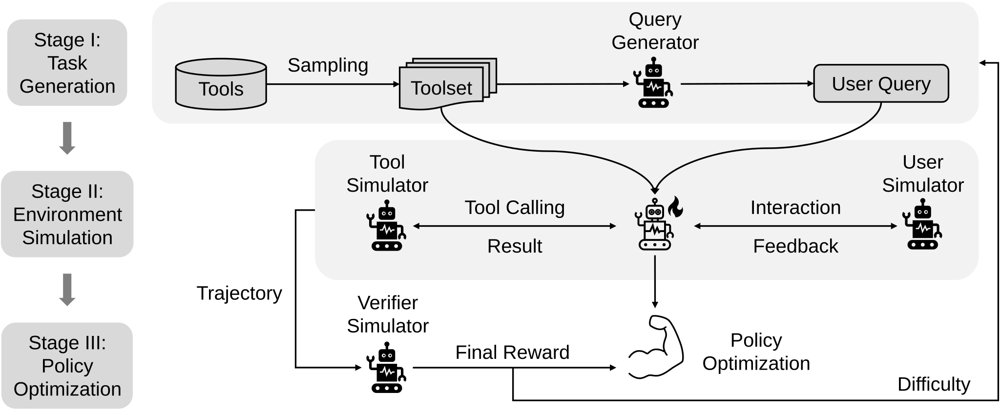

# TRUSTEE: Tool Learning Using Simulated Environments

The source code of the paper **Democratizing Tool Learning with Environments Fully Simulated by a Free 8B Language Model**.

We base our code on `verl` and implement TRUSTEE as a recipe extension (`verl/recipe/trustee`).



## Setup
### Hardware Requirements
We run experiments on a machine with 8× NVIDIA H20 GPUs.
### Installation
#### Install from Custom Environment (Verified in Our Local Environment)
Our Python environment is based on CUDA `12.9.1`, cuDNN `9.10.2`, Python `3.12`, vLLM `0.12.0`, PyTorch `2.9.0`, and Transformers `4.57.0`.

You may use the `setup_environment.sh` script to install the environment.

We have provided a `requirements.txt` file showing our local environment. We do not recommend installing from this file directly since it serves as a reference for our local environment only.

#### Install from Docker (Unverified)
If you prefer to install from Docker, please refer to the official installation guide of [verl](https://verl.readthedocs.io/en/latest/start/install.html#installation-from-docker) to install the package from Docker. Note that we use `verl==0.7.0` and `vllm==0.12.0`.

### Data
The tool repository is available at `verl/recipe/trustee/data/toolbench_tools.json`. The `verl/recipe/trustee/data/valid.parquet` is a placeholder for the validation set, with tasks generated by a weaker model in our early experiments.

### Language Models
Setup your path of `HOME` in `prepare_model.sh`. Then
```bash
bash prepare_model.sh
```

Finally, change to the `verl` directory:
```bash
cd verl
```

## Running TRUSTEE
First, setup your path of `HOME` in `verl/recipe/trustee/scripts/serve_env.sh` and start the simulator server by running the following command:
```bash
bash recipe/trustee/scripts/serve_env.sh
```

Then, setup the `model_scale` (e.g., `8B`), your path of `HOME`, and your `WANDB_API_KEY` in `verl/recipe/trustee/scripts/run.sh`. Finally, run the following command to start the training:
```bash
bash recipe/trustee/scripts/run.sh
```

The checkpoints will be saved in `$HOME/checkpoints/TRUSTEE/$exp_name`.

For more details of our ablation experiments, please refer to `verl/recipe/trustee/scripts/ablations/README.md`.

## Evaluation
Setup your path of `HOME` in `verl/recipe/trustee/scripts/bfcl.sh` and run the following command to evaluate the model on BFCL:
```bash
bash recipe/trustee/scripts/bfcl.sh
```

## Acknowledgements
The codebase has referred to [verl](https://github.com/volcengine/verl) and we thank the team for their valuable contributions to the community.
